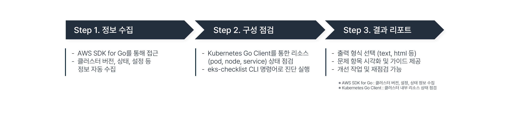
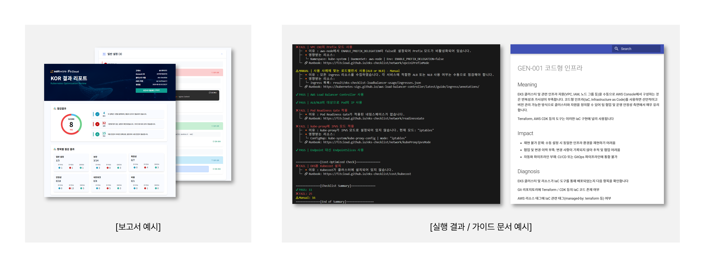

# KOR

**KOR (Kubernetes Optimization Review)**는 Amazon EKS(Elastic Kubernetes Service) 클러스터의 설정과 상태를 6개 영역(**일반**, **보안**, **확장성**, **안정성**, **네트워크**, **비용**)으로 나누어 종합적으로 진단하여 리포트 및 개선 방안을 제공합니다.

> 이 도구는 Go 언어로 작성되었으며, AWS SDK for Go, Kubernetes Go Client, 그리고 CLI 명령어 프레임워크인 Cobra를 활용하여 제작되었습니다.

---

## ✅ 프로젝트 목적

**KOR**는 EKS Cluster의 문제를 사전에 식별하고 개선할 수 있도록 설계된 도구입니다. AWS 및 Kubernetes의 **모범 사례(Best Practices)**를 기반으로 클러스터 상태를 분석하고, 점검을 통해 식별된 모든 Fail 결과에 대해 의미 있는 Runbook을 제공하여 사용자가 신속하게 문제를 해결하고 보다 안정적이고 효율적인 Cluster 환경을 구축하는 것을 목표로 합니다.

---

## 📋 점검 항목

| 카테고리        | 설명 |
|----------------|------|
| **일반 (General)**   | 클러스터 버전, 태그 구성, 메타데이터 등 기본적인 구성이 모범사례에 맞게 구성되어 있는지 확인 |
| **보안 (Security)**       | IAM 정책, 인증 구성, API 서버 접근 제어 등 보안 관련 설정이 적절히 되어 있는지 점검하여 클러스터의 보안 설정 확인 |
| **확장성 (Scalability)**  | HPA (Horizontal Pod Autoscaler), Cluster Autoscaler, 노드그룹 등 클러스터의 확장성과 자원 관리의 자동화를 위한 설정 점검 |
| **안정성 (Reliability)**    | 로그, 모니터링, 백업 설정 등의 설정 유무를 점검하여 클러스터의 안정성 진단 | -->
| **네트워크 (Network)**    | VPC, Subnet, 보안 그룹, ENI, IP 할당 등의 네트워크 구성 요소가 최적화되어 있는지 점검 |
| **비용 최적화 (Cost)**     | 클러스터 리소스 최적화를 통해 과도한/미사용 리소스 확인, 고사양/미사용 인스턴스를 탐지를 통한 절감 방안 식별 |

---

## 🔍 작동 방식

**KOR**는 클러스터 정보를 자동 수집한 뒤 구성 요소를 점검하고, 결과를 리포트 형태로 제공합니다.
이를 통해 문제 영역을 빠르게 식별하고 개선 가이드를 받아 재점검까지 진행할 수 있습니다.

