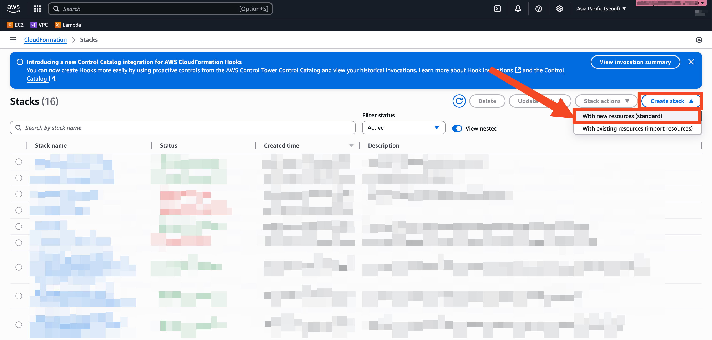
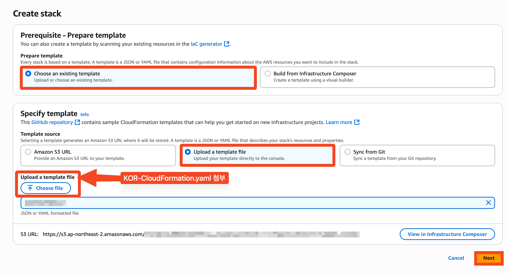
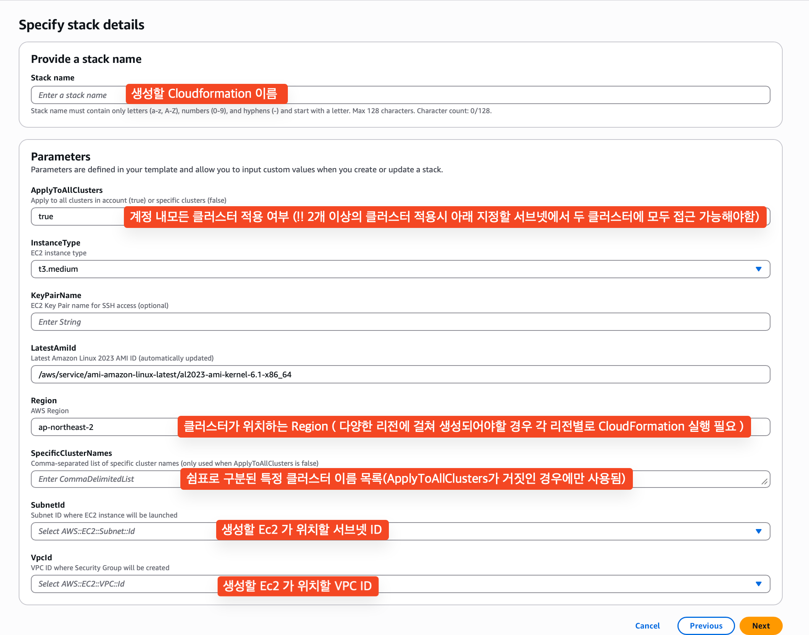

# KOR Service Setup Guide

## 개요
본 가이드는 KOR(Kubernetes Operations and Resource) 서비스를 위해 AWS CloudFormation을 활용하여 EC2 인스턴스에 Docker와 kubectl을 자동으로 설치하고, EKS 클러스터 접근 권한을 설정하는 절차를 설명하며, 해당 자동화 과정에서 생성되는 각 리소스의 역할 및 권한 구조를 중점적으로 다룹니다.


## 생성되는 AWS 리소스

### 1. IAM 리소스

#### **KorRole** (AWS::IAM::Role)
- **목적**: EC2 인스턴스가 AWS 서비스에 접근할 수 있는 권한 제공
- **주요 권한**:
  - EKS 클러스터 조회 및 관리 (ListClusters, DescribeCluster 등)
  - EC2 인스턴스 정보 조회
  - Saltware 측 S3 버킷 접근 (읽기/쓰기)
  - SSM 관리 인스턴스 코어 정책
- **사용 목적**: KOR 서비스가 Kubernetes 클러스터를 관리하고 모니터링할 수 있도록 함

#### **KorInstanceProfile** (AWS::IAM::InstanceProfile)
- **목적**: EC2 인스턴스에 IAM 역할을 연결하는 브릿지 역할
- **연결**: KorRole과 EC2 인스턴스를 연결

### 2. 네트워킹 리소스

#### **KorEC2SecurityGroup** (AWS::EC2::SecurityGroup)
- **목적**: EC2 인스턴스의 네트워크 보안 제어
- **설정**:
  - **Ingress**: 기본적으로 모든 인바운드 트래픽 차단
  - **Egress**: HTTPS(443), HTTP(80) 아웃바운드 허용
- **사용 목적**: AWS API, Docker Hub, kubectl 다운로드를 위한 최소한의 네트워크 접근 허용

### 3. 컴퓨팅 리소스

#### **KorEC2Instance** (AWS::EC2::Instance)
- **목적**: KOR 서비스를 실행할 메인 서버
- **특징**:
  - Amazon Linux 2023 최신 AMI 사용
  - SSM Agent 자동 설치 및 활성화
  - 선택적 SSH 키 페어 지원
- **사용 목적**: Docker 컨테이너와 kubectl을 통한 Kubernetes 관리 작업 수행

### 4. 시스템 관리 리소스

#### **DockerKubectlInstallDocument** (AWS::SSM::Document)
- **목적**: Docker와 kubectl 자동 설치를 위한 SSM 문서
- **설치 내용**:
  - Docker 엔진 설치 및 서비스 활성화
  - kubectl 최신 버전 다운로드 및 설치
  - ec2-user를 docker 그룹에 추가
- **사용 목적**: 수동 설치 없이 필요한 도구들을 자동으로 구성

### 5. Lambda 함수들

#### **SSMExecutionLambdaFunction** (AWS::Lambda::Function)
- **목적**: SSM 문서 실행을 자동화하는 커스텀 리소스
- **기능**:
  - EC2 인스턴스 준비 상태 대기
  - SSM Agent 활성화 확인
  - Docker/kubectl 설치 명령 실행
  - 설치 결과 모니터링
- **사용 목적**: CloudFormation 스택 생성 시 자동으로 소프트웨어 설치

#### **EKSSetupLambdaFunction** (AWS::Lambda::Function)
- **목적**: EKS 클러스터 접근 권한 자동 설정
- **기능**:
  - EKS AccessEntry 생성
  - AdminViewPolicy 연결
  - 클러스터 보안 그룹에 EC2 접근 규칙 추가
  - 모든 클러스터 또는 특정 클러스터 선택적 적용
- **사용 목적**: KOR 서비스가 EKS 클러스터에 접근할 수 있도록 권한 자동 구성

### 6. 커스텀 리소스

#### **SSMExecutionCustomResource**
- **목적**: SSM 문서 실행을 CloudFormation 라이프사이클에 통합
- **동작**: EC2 인스턴스 생성 후 자동으로 Docker/kubectl 설치 실행

#### **EKSSetupAllClustersCustomResource** / **EKSSetupSpecificClustersCustomResource**
- **목적**: EKS 클러스터 설정을 CloudFormation 라이프사이클에 통합
- **조건부 생성**: 
  - 모든 클러스터 적용 시: EKSSetupAllClustersCustomResource
  - 특정 클러스터 적용 시: EKSSetupSpecificClustersCustomResource

## 파라미터

### 필수 파라미터
- **SubnetId**: EC2 인스턴스가 배포될 서브넷 ID
- **VpcId**: 보안 그룹이 생성될 VPC ID

### 선택적 파라미터
- **InstanceType**: EC2 인스턴스 타입 (기본값: t3.medium)
- **KeyPairName**: SSH 접근을 위한 키 페어 (선택사항)
- **ApplyToAllClusters**: 모든 클러스터 적용 여부 (기본값: true)
- **SpecificClusterNames**: 특정 클러스터 이름 목록
- **Region**: AWS 리전 (기본값: ap-northeast-2)

## 배포 방법

1. CloudFormation 콘솔에 접속
2. "Create stack" 선택



3. template-6.yaml 파일 업로드



4. 필수 파라미터 입력 (파라미터 값 위 내용 참고)



6. 스택 생성 실행

## 출력값

### EC2 관련
- **InstanceId**: 생성된 EC2 인스턴스 ID
- **InstancePrivateIP**: EC2 인스턴스 프라이빗 IP
- **SecurityGroupId**: 생성된 보안 그룹 ID

### IAM 관련
- **RoleName**: 생성된 IAM 역할 이름
- **RoleArn**: 생성된 IAM 역할 ARN
- **InstanceProfileName**: 생성된 인스턴스 프로파일 이름

### EKS 관련
- **ClustersProcessed**: 처리된 EKS 클러스터 수
- **ProcessingResults**: 각 클러스터별 처리 결과 (JSON 형식)
- **TargetClusters**: 처리 대상 클러스터 목록

### 설치 관련
- **SSMDocumentName**: SSM 문서 이름
- **SSMCommandId**: 설치 명령 ID
- **InstallationStatus**: 설치 상태

## 이후 진행내용

생성된 Ec2 접근 후 아래 AWS CLI 명령어를 통해 kubectl profile 등록

```
aws eks update-kubeconfig --name <EKS Cluster Name> --region <Region> 
```

도커 컨테이너 실행 진행

```bash
#!/bin/bash

set -e

docker run -it --rm \
    -e AWS_ACCESS_KEY_ID=$(aws configure get aws_access_key_id) \
    -e AWS_SECRET_ACCESS_KEY=$(aws configure get aws_secret_access_key) \
    -e AWS_SESSION_TOKEN=$(aws configure get aws_session_token) \
    -e AWS_DEFAULT_REGION=ap-northeast-2 \
    -v ~/.kube:/root/.kube \
    -v ./output:/output \
    <KOR ECR 레지스트리 URL> \
    --output html
```

이후 추출 될 html 파일 및 이미지 파일 AWS CLI 를 통해 솔트웨어 버킷으로 전송 합니다.
